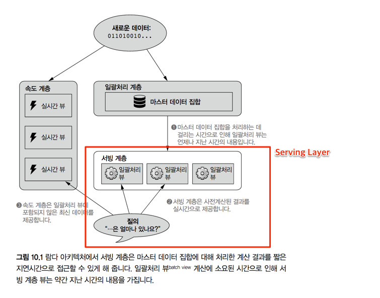
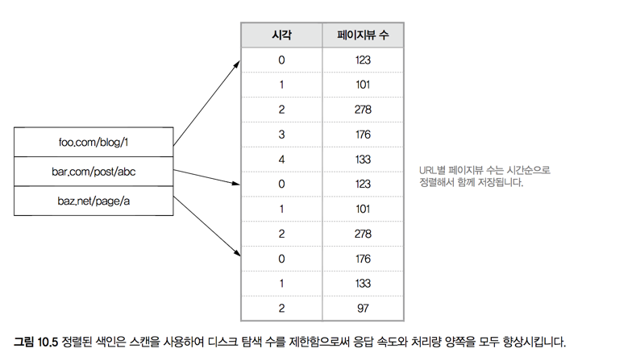
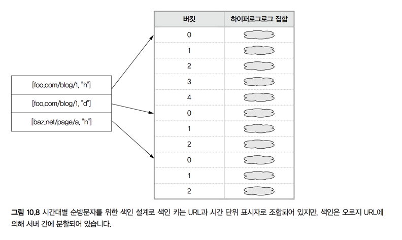
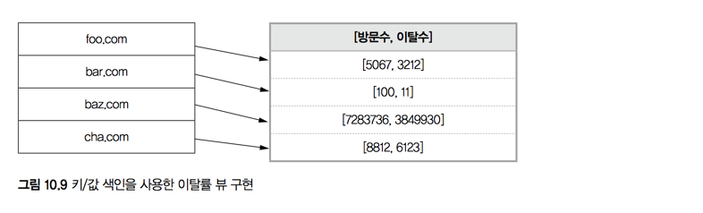

# 10. 서빙 계층

> 학습목표
- 서빙할 질의에 대한 일괄처리 뷰 다듬기
- 데이터 정규화 vs 비정규화 문제에 대한 새로운 시각
- 일괄 쓰기 & 무작위 읽기가 가능하고 무작위 쓰기가 불가능한 DB의 장점
- 완전 증분 방식 vs 람다 아키텍처 방식

#### 람다 아키텍처에서 서빙 계층의 위상상

- [ ] 지연시간, 리소스 사용, 지연시간 변동을 최소화하기 위한 색인 전략
- [ ] 람다 아키텍처에서 서빙 계층에 필요한 요구사항
- [ ] 오랜 논쟁거리인 정규화 대 비정규화 문제를 서빙 계층에서 푸는 방법

## 10.1 서빙 계층에 대한 성능 측정기준
- 성능 측정기준
  - 처리량: 얼마나 많은 질문을 처리하는가?
  - 지연시간: 답을 얼마나 빨리 뱉어내는가?

#### ex> `SWA`의 시간대별 PV
- Key-Value 색인전략
  - `[URL, hour]`를 key로, `PV`값을 value로
  - 이론적으로는 잘 작동하나, 실제로는 다음 두 가지 측면에서 문제 발생
    - **지연시간**: 특정 URL에 대한 값들이 클러스터 전체에 흩어져 있을 수 있다
    - **처리량**: 고비용인 디스크 탐색이 잦을 수 밖에 없다.
  - 위 문제를 해결할 수 있는 색인 전략
    - 같은 URL에 대한 페이지뷰 정보를 동일한 분할부 안에 모이게 만들고, 시간 순서로 저장
    - 한 번 읽어오는 데이터가 한 곳에 있다면, 지연시간 & 처리량 모두 위 문제 해결

## 10.2 정규화/비정규화 분제에 대한 서빙 계층의 해결책

#### 비정규화의 딜레마
- **장점**: Join에 들어가는 비용이 크기 때문에, 데이터를 테이블마다 중복 저장하여 속도 향상
- **단점**: 중복된 데이터가 생기기 때문에 데이터를 일관성을 유지하는데 비용이 커진다
- 데이터의 일관성을 유지하는 책임은 오직 **개발자의 몫**

#### in 람다 아키텍처...
- 일괄처리 계층
  - 마음껏 데이터를 정규화하라
  - 대량 데이터를 읽기 때문에 무작위 읽기에 최적화(색인 등)에 신경 쓸 필요 없음
- 서빙 계층
  - 데이터를 질의의 입맛에 맞게 빌드
  - 효율을 올리기 위해 어떤 종합/변형 연산도 첨가할 수 있다
- 정보가 일괄처리 계층 & 서빙 계층에 중복 저장되는건 틀림없는 사실이나
  - 서빙 계층을 하나의 `View`개념으로 본다면 문제없다.
  - 인적 오류로 둘 간의 데이터가 불일치한다 해도 재계산하면 끝

## 10.3 서빙 계층 데이터베이스에 대한 요구사항
- [x] **일괄 쓰기**: 데이터 갱신시 새 버전의 뷰 생성 후 기존의 뷰와 맞바꿈
- [x] **확장성**: HDFS와 같이 여러 장비에 서빙 계층 데이터베이스를 분산할 수 있어야 한다
- [x] **무작위 읽기**: 질의 처리의 짧은 응답속도를 확보
- [x] **내결함성**: *확장성* 에서 보듯 분산되어 제공될 가능성이 높음
- [ ] ~~무작위 쓰기~~: 전체 데이터가 *일괄 쓰기* 로만 작성
  - 람다 아키텍처 내 *무작위 쓰기* 가 필요한 지점: 속도 계층
  - **압밀화** 도 불필요: 운영에 대한 복잡요소의 감소

## 10.4 `SWA`를 위한 서빙 계층 설계
- 현재 **일괄처리 계층** 까지 구현이 끝난 상태
    - 구현된 일괄처리 뷰: 시간대별 페이지뷰, 순 방문자, 이탈률 분석
    - 색인 X -> 위 일괄처리 뷰를 색인하여 응답시간을 줄이는 것이 목표!
- 서빙 계층은 실제가 이론에 뒤처진다
  - 전통적인 DBMS를 사용하는 것에 대한 유혹
  - 하지만 **확장성**, **내결함성** 등의 요구조건에 안 맞음
    -> ElephantDB? Impala?

### 10.4.1 시간대별 페이지뷰
- 이상적인 색인: Key-Value 맵
  - 일괄처리 뷰에서는 시각 단위, 1일, 7일, 28일, 365일 단위로 집계
  - K-V 맵으로 색인 구성시 주어진 범위에 값들이 순서대로 저장되기에 순차 읽기를 하면 효율적

### 10.4.2 시간대별 순방문자
- 시간대별 페이지뷰와의 비교
  - 유사점: 일정 범위의 값들을 기반으로 합친 값을 가져옴
  - 차이점: 값이 HyperLogLog로 구성 - 크기, 합계연산 모두에서 불리
- 대안: 큰 시간 단위를 함께 사용
- [x] 키: URL과 시간단위 표시자 (`h`, `d` ...)로 조합
- [x] 색인: **URL & 시간단위** 가 아닌 **URL** 만 사용하여 분할
  - **URL & 시각단위**를 키로 색인하는 경우: 버킷이 잘게 쪼개지며 쪼개진 버킷은 서버별로 고루 분산 될 수 있음
  - **URL**에 대해서 색인시 버킷의 단위가 커지며 같은 서버에 모임
  - **색인 단순화**: 질의 하나에 서버 여러대와 상호작용할 가능성이 낮아짐

### 10.4.3 이탈률 분석
- 단순함
- Key: 도메인
- Value: [방문수, 이탈수] Tuple

## 10.5 완전 증분 솔루션과의 대조

### 10.5.1 시간대별 순방문자를 위한 완전 증분 해결책

### 10.5.2 람다 아키텍처 솔루션과의 비교
- 동일관계를 고려한 시간대별 순방문자 처리와 같은 문제를 해결: 람다 아키텍처가 >>>> 증분 아키텍처에
  - 오류율, 지연시간, 부가비용(특별한 하드웨어 필요 등) 한 점 등에서 뛰어남
- 일괄처리 계층에서 한 번에 모든 데이터를 상대할 수 있어서 발현되는 특성
  - 증분: 동일관계가 하나씩 생길 때마다 관련 처리를 해야 하기 때문에 HyperLogLog와 같은 알고리즘 사용 불가
  - 람다: 주어진 시점에서 동일관계 처리를 선행한 후 그를 기반으로 시간대별 방문자 뷰를 만들기 때문에 더 효율적인 전략을 구사 가능
- 동일관계는 속도 계층에서도 다루어지는데, 일괄처리 계층의 존재가 이 문제를 훨씬 쉽게 만들어 주는 기반이 됨

## 10.6 요약
#### 배운 것
- 지연시간과 처리량 최적화를 위한 뷰 커스터마이징
- 무작위 쓰기를 배재함으로써 간결해지는 아키텍처
- **일괄처리 계층: 정규화된 데이터 & 서빙 계층: 비정규화된 데이터**
- 마스터 데이터 집합으로부터 재계산이 가능성으로 인한 **내결함성**

##### 일괄처리 뷰와 독립적인 관계라서 가능한 장점
  - 입맛(질의)에 맞는 데이터를 미리 빌딩해 놓는 유연함  
  - 정규화 & 비정규화의 딜레마 해결
  - 압밀화같은 운영 부담 감소

#### 배울 것
- 서빙 계층 데이터베이스의 실제
