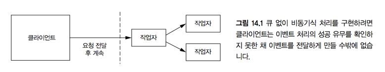
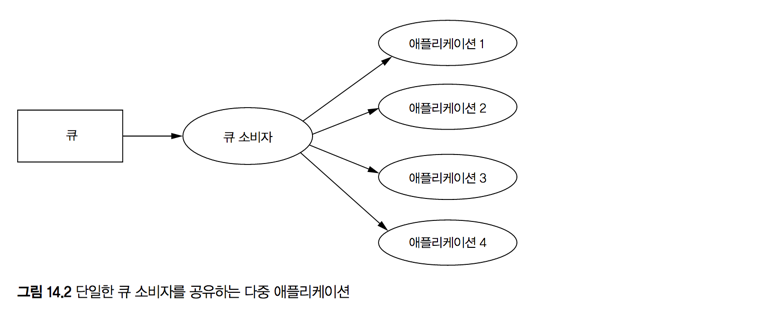
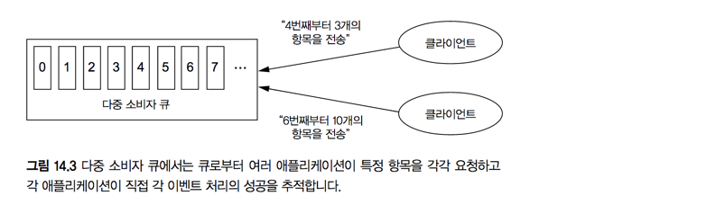

# 14. 큐잉과 스트림 처리

> 학습목표
- 단일 소비자 큐 vs 다중 소비자 큐
- Exactly-once
- Queue - Consumer 방식의 한계

At-most-once(최대 한 번): 데이터 유실이 있을 수 있어, 추천하지 않는 방식
At-least-once(적어도 한 번): 데이터 유실은 없으나 재전송으로 인해 중복이 생길 수 있음. 대부분의 경우 충분한 방식
Exactly-once(딱 한 번): 데이터가 오직 한 번만 처리되어 유실도 중복도 없음. 모든 상황에 대해 완벽히 보장하기 어렵지만 가장 바라는 방식

#### 동기식 vs 비동기식
- 동기식: 일반적인 방식, 아키텍처 관점에서 심플
- 비동기식:
  - DB & Application이 독립적,
  - 요청에 대한 갱신을 직접 처리할지, 유지할 것인지에 대한 결정이 전체 시스템의 확장성 & 내결함성을 좌우

#### 큐잉 & 스트림 처리
- 일괄처리의 핵심인 **내결함성** 과 **재계산 가능성** 이 역시 중요함
- 증분처리를 염두에 두었을 때 증가하는 복잡성을 어떻게 극복할 것인가?

## 14.1 큐잉
#### 발사 후 망각(fire-and-forget)
- 모든 데이터가 성공적으로 처리된다는 보장이 없다
- 트래픽 폭발에 취약

#### 지속성 큐
- 작업 실패시 재시도가 가능
- 이벤트 버퍼를 제공
- Queue interface of **JAVA**



```java
interface Queue {
  void add(Object item);  // push new item
  Object poll();  // pop item from head of queue  
  Object peek();  // read item from head of queue without pop
}
```

### 14.1.1 단일 소비자 큐
- 단일 소비자 구조를 가진 큐
```java  
struct Item {
  long id;      // Identifier
  byte[] item;  // Binary payload
}

interface Queue {
  Item get();
  void ack(long id);
  void fail(long id);
}
```


#### 특징
- 이벤트를 읽을 때 즉시 제거하지 않음
  - `get`메서드에서 반환된 항목을 식별자에 저장 후 이를 사용하여 이벤트 처리에 대한 `ack`/`fail`판단
  - `ack`: 읽은 후 큐에서 제거
  - `fail`: `get()`을 호출하는 다른 클라이언트로 해당 항목을 읽도록 시도
- 같은 항목이 여러 번 수행될 가능성이 있지만, **최소 한 번은 확실히 처리**
- 각 어플리케이션 간 독립된 큐 서버 유지
  - 여러 어플리케이션이 하나의 스트림을 공유시 어플리케이션 간 고립성 침해
  - 큐 서버에 부담 증가

#### 단일 소비자 큐에 비추어 본 "바람직한 큐 시스템"
- 단일한 큐에 많은 컨슈머 수용
- 간단한 컨슈머 추가
- 소비되는 항목에 대한 추적을 큐가 직접 책임


### 14.1.2 다중 소비자 큐
- 핵심 아이디어: 이벤트의 소비/비소비 여부를 추적할 책임을 큐가 아닌 어플리케이션에게 부여
- SLA(Service Level Agreement): 일정한 양 만큼 스트림이 가능하도록 보장
- `ack`를 받더라도 큐에서 제거되지 않는다: 스트림 이력 내 어느 시점에서도 이벤트 재현 가능
- 단일 소비자 큐에 대비해 딱히 단점이 없음


