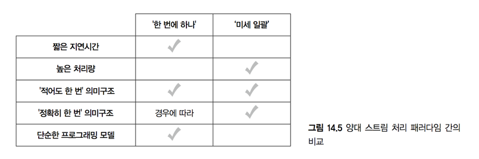

# 14. 큐잉과 스트림 처리

> **학습목표**
- 단일 소비자 큐 vs 다중 소비자 큐
- Exactly-once
- Queue - Consumer 방식의 한계

#### 동기식 vs 비동기식
- 동기식: 일반적인 방식, 아키텍처 관점에서 심플
- 비동기식:
  - DB & Application이 독립적,
  - 요청에 대한 갱신을 직접 처리할지, 유지할 것인지에 대한 결정이 전체 시스템의 확장성 & 내결함성을 좌우

#### 큐잉 & 스트림 처리
- 일괄처리의 핵심인 **내결함성** 과 **재계산 가능성** 이 역시 중요함
- 증분처리를 염두에 두었을 때 증가하는 복잡성을 어떻게 극복할 것인가?

## 14.1 큐잉
#### 발사 후 망각(fire-and-forget)
- 모든 데이터가 성공적으로 처리된다는 보장이 없다
- 트래픽 폭발에 취약


#### 지속성 큐
- 작업 실패시 재시도가 가능
- 이벤트 버퍼를 제공
- Queue interface of **JAVA**


```java
interface Queue {
  void add(Object item);  // push new item
  Object poll();  // pop item from head of queue  
  Object peek();  // read item from head of queue without pop
}
```

### 14.1.1 단일 소비자 큐
- 단일 소비자 구조를 가진 큐
```java  
struct Item {
  long id;      // Identifier
  byte[] item;  // Binary payload
}

interface Queue {
  Item get();
  void ack(long id);
  void fail(long id);
}
```


#### 특징
- 이벤트를 읽을 때 즉시 제거하지 않음
  - `get`메서드에서 반환된 항목을 식별자에 저장 후 이를 사용하여 이벤트 처리에 대한 `ack`/`fail`판단
  - `ack`: 읽은 후 큐에서 제거
  - `fail`: `get()`을 호출하는 다른 클라이언트로 해당 항목을 읽도록 시도
- 같은 항목이 여러 번 수행될 가능성이 있지만, **최소 한 번은 확실히 처리**
- 각 어플리케이션 간 독립된 큐 서버 유지
  - 여러 어플리케이션이 하나의 스트림을 공유시 어플리케이션 간 고립성 침해
  - 큐 서버에 부담 증가

#### 단일 소비자 큐에 비추어 본 "바람직한 큐 시스템"
- 단일한 큐에 복수의 컨슈머 수용
- 컨슈머 추가는 간단해야 함
- 소비되는 항목에 대한 추적을 큐가 직접 책임진다


### 14.1.2 다중 소비자 큐
- 핵심 아이디어: 이벤트의 소비/비소비 여부를 추적할 책임을 큐가 아닌 어플리케이션에게 부여
- SLA(Service Level Agreement): 일정한 양 만큼 스트림이 가능하도록 보장
- `ack`를 받더라도 큐에서 제거되지 않는다: 스트림 이력 내 어느 시점에서도 이벤트 재현 가능
- 단일 소비자 큐에 대비해 딱히 단점이 없음


## 14.2 스트림 처리
- 스트림 처리: 큐에 이벤트가 공급되면 이를 받아서 실시간 뷰에 반영하고 갱신하는 일련의 작업

#### 한 번에 하나 vs 미세 일괄
- 각각 강점과 약점이 있어 반대급부를 고려 필요
- 상호보완적 관계
- 한 번에 하나 방식의 가장 큰 장점: **짧은 지연시간**




### 14.2.1 큐-작업자 모델
- 컨셉: 이벤트 처리 파이프라인을 작업자 프로세스 단위로 분리 후 이들 사이에 큐를 배치
- 작업자가 실패하거나 작업자 프로세스 재시작시 그만둔 지점부터 큐를 읽어 재시작 가능
- 한 번에 하나 방식의 스트림 처리 구현시 흔히 사용되는 모델


#### 예제
  

- 첫 번째 작업자 집합
  - 큐 집합으로부터 페이지뷰 이벤트 확인
  - 각 페이지뷰에 대한 유효성 검사 후 두 번째 작업자 집합에 이벤트 전달
- 두 번째 작업자 집합
  - 유효한 URL 개수 갱신

### 14.2.2 큐-작업자 접근법의 함정
- **내결함성에 문제** 발생 가능
  - 경쟁 조건(race-condition) 발생: 같은 URL의 페이지뷰를 여러 작업자가 동시에 갱신 시도
  - 이를 회피하기 위해 첫 번째 작업자 집합에서 출력되는 스트림을 URL기준으로 분리
  - 이 때, DB를 갱신하는 작업자에 장애가 발생시 어떤 작업자도 해당 스트림 영역에 DB갱신 불가능
- 시스템 운영 부담 증가
  - 처리 토폴로지 변경 필요시 시스템 재배포 전에 모든 큐의 flush 필요
  - 각각의 큐들에 대한 관리 및 모니터링 필요
- latency, throughput 모두 감소
  - 큐에 있는 이벤트는 디스크 IO 유발
  - 작업자간 이벤트 전달시 제 3자 개입 필요
- too much boilerplates

## 14.3 '한 번에 하나' 방식의 상위 수준 스트림 처리
- Queue-Consumer 모델을 일반화하면서 복잡성을 제거
- 클러스터에서 병렬 실행: 높은 throughput과 확장성 보장

### 14.3.1 스톰 모델
- 직렬화, 메시지 전송, 태스크 탐지 및 내결함성을 위한 작업 등이 추상화되어 제공
- 위 작업에 소요되는 응답시간이 매우 낮음(10ms 이하)

#### 스톰 모델의 추상 개념 소개
- 투플(tuple): 값의 리스트
- 스트림(stream): 투플의 무한 순차열
- 스파우트(spout): 토폴로지에서 스트림의 공급원
- 볼트(bolt): 스트림에 대해 **동작** 을 수행(하나의 함수 개념인 듯)  

---
- 토폴로지(topology): 각각의 독립된 계산 단위 그래프 -> 스파우트와 볼트의 네트워크  
- 태스크(task): 스파우트 혹은 볼트의 인스턴스  

---
- 스트림 그룹화(stream grouping): 투플 소비자 태스크에게 투플을 분배하는 방법을 제공
  - 셔플 그룹화: RR, 부하가 균등하게 분배
  - 필드 그룹화: 투플의 특정 필드를 해시값을 참조하여 분배(해시값 % 태스크 수 => 결과값에 따라 분배)


#### 스톰 모델의 핵심
- 각 태스크들이 내재적으로 병렬적 (맵과 리듀스 태스크가 내재적으로 병렬적인것과 같은 개념)
- 태스크들은 분산된 장비에서 병렬적으로 수행 가능

#### 단어 수 세기 예제
- 분리자 볼트: 문장 스트림 => 단어 스트림
```java
class SplitterBolt {  // 볼트는 내부에 상태정보를 저장할 수 있기 떄문에 객체로 정의
  function execute(sentence) { // 볼트는 투플을 넘겨받음, 이 경우 하나의 필드에 하나의 투플 전달
    for (word in sentence.split(" ")) {
      emit(word)  // 출력 스트림으로 단어를 방출
    }
  }
}
```

- 단어 수 세기 볼트: 단어의 개수를 계산
```java
class WordCountBolt {
  counts = Map(default = 0) { // 단어 수는 메모리에 적재
    function execute(word) {  
      counts[word]++;
      emit(word, counts[word]);
    }
  }
}
```

- 필드 그룹화: 단어 수 세기 태스크가 모든 단어의 모든 인스턴스를 바라봄 => 정확한 카운트 계산
- 투플을 어디로 보낼지, 어떻게 직렬화할지에 대한 로직이 전무 => 추상화 단계에서 처리

### 14.3.2 메시지 처리 보장하기 (적어도 한 번)

> **스트림 처리의 신뢰도에 따른 보장 방식 구분**  
- At-most-once(최대 한 번): 데이터 유실이 있을 수 있어, 추천하지 않는 방식
- At-least-once(적어도 한 번): 데이터 유실은 없으나 재전송으로 인해 중복이 생길 수 있음. 대부분의 경우 충분한 방식
- Exactly-once(딱 한 번): 데이터가 오직 한 번만 처리되어 유실도 중복도 없음. 모든 상황에 대해 완벽히 보장하기 어렵지만 가장 바라는 방식


#### 투플 DAG(Directed acyclic graph)
- 스파우트 투플 한 개를 처리하는동안 생성된 모든 투플을 방향성 비순환 그래프로 시각화한 것

##### 단어 수 세기의 DAG
- 문장 투플이 스파우트에서 생성
- 스파우트에 구독을 걸어 둔 모든 볼트로 투플을 전송
- 단어 분리자 볼트는 스파우트에서 투플 한 개를 받아 6개의 단어 투플 생성
- 단어 투플은 단어 수 세기 볼트로 전송되어 각 단어 당 하나의 단어 수 투플 생성


> **투플 DAG에 대한 추적에 대한 확장성과 효율성**
스파우트 하나에 대한 추적을 위해서는 필요한 공간은 20byte정도인데, 이는 DAG의 크기에 상관없이 동일
매우 효율적인 이 알고리즘으로 인해 스트림 처리 도중 실패를 추적 & 재시도 가능

#### 전체 재처리가 성능상 후퇴인가?
- 작업자가 죽는 등의 이유로 실패시 스톰은 토폴로지의 근원점으로부터 재시작
- **적어도 한 번** 보장을 위해 실패 지점에서 재시도하는 것은 의미가 없고 시작부터 다시 해야 함(?)
- **정확히 한 번** 보장을 위해서 **적어도 한 번** 은 필요조건

> **작업에 대한 '적어도 한 번' 처리 보장**  
- 토폴로지의 연산들이 모두 **[멱등성](https://ko.wikipedia.org/wiki/%EB%A9%B1%EB%93%B1%EB%B2%95%EC%B9%99)**(idempotence)을 띄는 경우 **정확히 한 번** 처리를 의미
- 비멱등 연산이 포함된 경우에 생기는 약간의 부정확성은 무시
- 서빙 계층이 속도계층을 갱신하므로 부정확성은 최종적으로 정정
- 지연시간과 정확성 사이의 선택


## 14.4 `SWA`의 속도 계층
#### 시간대별 순방문자의 속도계층 처리

- **일괄처리 & 서빙 계층** 에서의 순방문자 계산 복기
  - *하이퍼로그로그* 를 사용하여 다른 집합과 병합 가능한 압축된 집합을 생성하여 조합 (약간의 정확도 희생)
  - 동일관계 간선을 사용하여 개인별 식별자 정규화 선행
  - 정규화 작업 완료 후 순방문자 수 계산을 하기 때문에 복잡도 낮음

- **속도 계층** 에서의 계산
  - 속도 계층이 갱신된 이후에 복수의 식별자 관계가 정리되는 문제 등으로 인해 복잡도 증가

##### 문제점
- 실시간으로 동일관계 그래프를 추적
- 같은 방문자가 중복으로 계산되었을 가능성 상정
  -> 매 시간마다 전체 방문자 집합 저장 필요
- 하이퍼로그로그의 경우 압축된 집합 표현이기 때문에 도움이 되지 않음
- 증분 알고리즘으로 구현시 복잡도는 훨씬 증가

##### 대안
- 동일관계 분석을 실시간으로 하지 않고, 서빙 계층에 저장된 동일관계 데이터를 사용
  - 속도계층의 `PersionID`는 시간대별 순방문자 계산 전에 정규화가 일어남
    - 실시간으로 동일관계를 계산할 필요가 없음(HyperLogLog의 장점 유지)
    - 구현이 편하고 자원을 적게 소모
  - 미리 계산된 동일관계는 유효기간이 짧음: 새로 발견된 동일관계 활용 불가
    - 사용자가 특정 페이지를 방문하여 ID 생성 후 얼마 지나지 않아 다른 IP주소로 접근시 부정확성 발생
    - `but` 위 케이스는 **새로 등록한** 사용자에 한해 발생: 발생 확률이 크지 않음
- 동일관계를 `PersonID`만을 기반으로 파악
  - 오래 전에 `PersonID` ~ `IP`간의 동일관계가 등록되었더라도 활용 불가능

-> 상황에 맞게 대안 선택

### 14.4.1 토폴로지 구조 설계
> **동일관계를 배제** 하고 시간대별 순방문자 수를 구하는 설계

#### Logic
1. `UserID`, `URL`, `Timestamp`를 가진 페이지뷰 이벤트의 스트림을 소비
2. `URL` 정규화
3. DB 갱신 (DB에는 URL로부터 시간을 대응시키고 이를 하이퍼로그로그 집합에 대응시키는 중첩 맵 포함)

#### Topology


- **페이지뷰 스파우트**: 큐에서 이벤트를 읽어서 다시 방출
- **URL 정규화 볼트**
  - URL을 표준 형식으로 정규화
  - 유효하지 않은 URL 필터링
  - 공통 라이브러리로 설계해 일괄처리 계층과 공유 가능
- **DB 업데이트 볼트**
  - *URL 정규화 볼트* 에서 내는 스트림을 소비하는 볼트
  - URL기준의 필드 그룹화를 사용하기에 경쟁 조건이 발행하지 않음
  - DB를 이용해 하이퍼로그로그집합을 유지
  - `Map[URL, SortedMap[hour, HyperLogLog]]` 구조
  - `HyperLogLog`를 기본적으로 지원하는 DB 사용이 유리


## 14.5 요약

#### 배운 것
- 짧은 지연시간을 가진 증분 처리의 복잡성
- `SWA`의 시간대별 순 방문자 구현에 투영해 본 **람다 아키텍처**
  - 페이지뷰 및 동일관계 데이터: **마스터 데이터 집합**
  - 이력용 뷰: **일괄처리 시스템**
    - 다른 개인 식별자를 가지더라도 동일관계 그래프 분석을 통해 동일 사용자로 연결
  - 실시간 뷰: **속도 계층**
    - 실시간 뷰를 증분으로 갱신하여 효율성 & 짧은 갱신시간 확보

#### 배울 것
- 실제 도구를 사용한 Queue와 스트림 처리 구현
