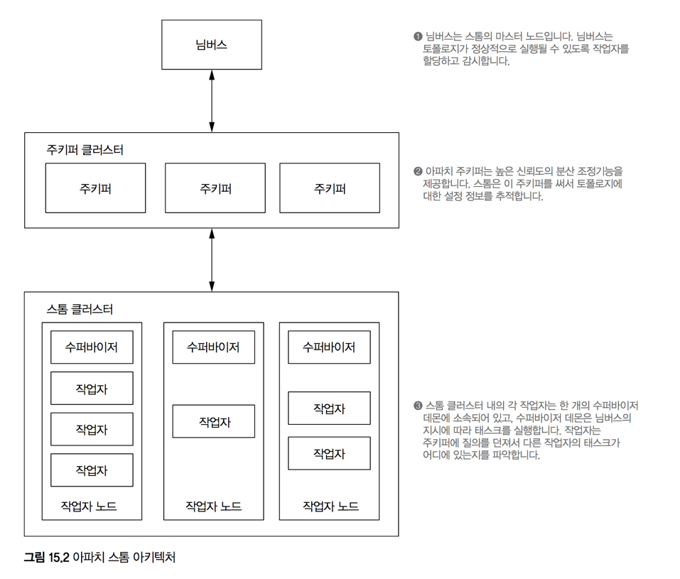

# 15. 큐잉과 스트림 처리: 사례

> **학습목표**
- 아파치 스톰
- 메시지 처리 보장
- 카프카 & 스톰 & 카산드라 콤비네이션
- `SWA`의 시간대별 순방문자를 구하는 속도계층 구현

## 15.1 아파치 스톰으로 토폴로지 정의
> 스톰 모델의 핵심 개념 상기
`Tuple`, `Stream`, `Spout`, `Bolt`, `Topology`


```java
public static void main(String[] args) throws Exception {
  TopologyBuilder builder = new TopologyBuilder();  //토폴로지 어플리케이션 정의
                                                    //TopologyBuilder객체는 스톰 토폴로지를 규정하는 API포함

  // 문장을 내보내는 스파우트 이 스파우트를 실행하기 위한 스레드가 클러스터 8개에 생성
  builder.setSpout("sentence-spout", new RandomSentenceSpout(), 8);

  // 문장 스트림을 받아 단어 스트림으로 바꾸는 볼트를 12개 생성하여 분산
  builder.setBolt("splitter", new SplitSentence(), 12)  
    .shuffleGrouping("sentence-spout");                 // 딱히 문장을 어떻게 소비할지에 대한 명시적인 요구가 없기에 셔플 그룹화를 사용

  // 단어 스트림을 소비하여 단어 개수를 카운트하는 볼트를 12개 생성
  builder.setBolt("count", new WordCount(), 12)       
    .fieldsGrouping("splitter", new Fields("word"));  // 필드 그룹화 사용: 같은 단어 처리시 하나의 태스크 할당

  Config conf = new Config();
  conf.setNumWorkers(4);
  StormSubmitter.submitTopoloty("word-count-topology", conf, builder.createTopology());
  conf.setMaxSpoutPending(1000);
}
```

#### 단어 분리자 볼트
- 들어오는 투플에서 첫 필드로부터 문장을 꺼내고
- 문장에 포함된 단어 전부에 대한 투플을 새로 만들어 방출

```java
public static class SplitSentence extends BaseBasicBolt {
  public void execute(Tuple tuple, BasicOutputCollector collector) {
    String sentence = tuple.getString(0); // 들어오는 투플은 문장 한 개를 포함
    for(String word: sentence.split(" ")) {
      collector.emit(new Values(word));   // 문장을 단어로 분리하여 출력 투플 스트림으로 방출
    }
  }
  public void declareOutputFields(OutputFieldsDeclarer declarer) {
    // 외부로 나가는 투플은 `word`로 이름붙인 한 개의 값으로 구성토록 정의
    declarer.declare(new Fields("word"));
  }
}
```

#### 카운터 볼트
- 인-메모리 해시맵에 단어 개수를 저장하는 방식으로 구현
- 데이터베이스와 통신하는 방식으로 구현하더라도 무방

```java
public static class WordCount extends BaseBasicBolt {
  // 인 메모리 해시맵은 볼트에 의해 수신된 모든 단어에 대한 개수 저장
  Map<String, Integer> counts = new HashMap<String, Integer>();

  public void execute(Tuple tuple, BasicOutputCollector collector) {
    String word = tuple.getString(0);         // 입력되는 투플로부터 단어 추출
    Integer count = counts.get(word);         // 현재 단어의 카운트를 가져옴
    if (count == null) count = 0;             // 해당 단어가 이전에 들어온 적이 없다면 단어수 초기화
    count++;                                  // 갱신
    counts.put(word, count);                  // 갱신된 단어 수를 저장
    collector.emit(new Values(word, count));  // 갱신된 단어 수를 방출
  }
  public void declareOutputFields(OutputFieldsDeclarer declarer) {
    // 단어와 해당 단어의 현재 개수로 구성된 출력 투플 선언
    declarer.declare(new Fields("word", "count"));  
  }
}
```

#### 스파우트
- 100ms마다 임의로 한 개를 선택하여 방출하면서 문장 스트림을 끝없이 생산
- 직접 스파우트를 만드는 방식으로 구현했지만...
   - 스톰은 카프카 등 여러 외부 큐로부터 데이터를 읽을 수 있는 미리 구현된 여러 스파우트를 자체 제공

```java
public static class RandomSentenceSpout extends BaseRichSpout {
  SpoutOutputCollector _collector;
  Random _rand;

  public void open(Map conf, TopologyContext context, SpoutOutputCollector collector) {
    _collector = collector;
    _rand = new Random();
  }

  public void nextTuple() {   // 스톰은 반복하여 `nextTuple`메서드를 호출
    Utils.sleep(100);         // 현재 상태를 100ms동안 지연

    // 스파우트에서 방출될 문장 배열
    String[] sentences = new String[] {   
      "the cow jumped over the moon",
      "an apple a day keeps the doctor away",
      "four score and seven years ago",
      "snow white and the seven dwarfs",
      "i am at two with nature"};
    String sentence = sentences[_rand.nextInt(sentences.length)];
    _collector.emit(new Values(sentence));  // 주어진 문장 중 하나를 임의 방출
  }

  public void declareOutputFields(OutputFieldsDeclarer declarer) {
    declarer.declare(new Fields("sentence")); // 출력 투플이 문장 하나로 구성되도록 선언
  }
}
```

## 15.2 아파치 스톰 클러스터와 배포




## 15.3 메시지 처리 보장하기
- 스톰 모델에서는 중간 큐 없이 메시지 처리를 보장 가능
  - 스파우트로부터 시작되는 투플 DAG에 실패가 감지되면 해당 스파우트로부터 투플을 재시도
- 투플 DAG 전체가 소진되고, 노드 모두가 완료 표시가 되었을 때 스파우트 투플이 온전히 처리되었다고 판단
- 타임아웃 발생시(기본 30초) DAG의 하향 스트림에서 작업자 프로세스 실패시 어떤 경우라도 실패로 간주

### 스톰의 메시지 처리 보장을 위한 로직
- **앵커링**(anchoring): 투플 DAG에 종속된 간선 생성시 스톰에게 알림
- **액킹**(acking): 투플 처리 종료시 스톰에게 알림

##### 단어 수 세기 볼트 예제 소환
```java
// `BasicRichBolt`를 상속하는 경우 명시적으로 투플의 앵커링과 액킹을 직접 처리해야 함
public static class SplitSentenceExplicit extends BaseRichBolt {
  OutputCollector _collector;

  public void prepare(Map conf, TopologyContext context, OutputCollector collector) {
    _collector = collector;
  }

  public void execute(Tuple tuple) {
    String sentence = tuple.getString(0);
    for(String word: sentence.split(" ")) {
      // 내보내는 단어 투플을 들어오는 문장 투플에 앵커링
      _collector.emit(tuple, new Values(word));
    }
    // 문장 투플이 성공적으로 처리되었다는 ack 전송 
    _collector.ack(tuple);
  }
  public void declareOutputFields(OutputFieldsDeclarer declarer) {
    declarer.declare(new Fields("word"));
  }
}
```


## 15.4 `SWA`의 시간대별 순방문자 수를 구하는 속도계층 구현
- 핵심: 동일관계를 무시하는 근사 방법 사용
- 아파치 스톰 & 아파치 카프카 & 아파치 카산드라 사용하여 구현

#### 설계


#### 페이지뷰 스파우트 구현
- 카프카 클러스터로부터 페이지뷰를 읽기 위해 카프카 스파우트를 초기화
- 페이지뷰는 스리프트 데이터 객체 형태로 카프카에 저장

```java
TopologyBuilder builder = new TopologyBuilder();
SpoutConfig spoutConfig = new SpoutConfig(
  new ZkHosts("zkserver:1234", "/kafka"),   // Zookeeper 설정
  "pageviews",    // Kafka 토픽
  "/kafkastorm",  // 스톰이 사용할 주키퍼 Namespace
  "uniqueSpeedLayer"  // 해당 스파우트의 ID
);

// 데이터 처리방식 설정(이진 레코드를 역직렬화해서 데이터 객체로 변환 )
spoutConfig.scheme = new PageviewScheme();   
// 스파우트를 16개 생성
builder.setSpout("pageviews", newKafkaSpout(spoutConfig), 16);
```

#### URL 정규화 볼트
- 페이지뷰 이벤트를 받아 URL을 정규화하여 방출

```java
public static class NormalizeURLBolt extends BaseBasicBolt {
  public void execute(Tuple tuple, BasicOutputCollector collector) {
    PersonID user = (PersonID) tuple.getValue(0);
    String url = tuple.getString(1);
    int timestamp = tuple.getInteger(2);

    try {
      // URL 정규화에 사용되는 함수는 일괄 계층에서 사용한 그것과 같다
      collector.emit(new Values(user, normalizeURL(url), timestamp));
    } catch(MalformedURLException e) {
      /* do nothing - 정규화가 실패하는 경우 해당 투플 Skip */
    }
  }
  public void declareOutputFields(OutputFieldsDeclarer declarer) {
    declarer.declare(new Field("user", "url", "timestamp"));
  }
}
```


#### 데이터베이스 갱신 볼트

```java
public static class UpdateCassandraBolt extends BaseBasicBolt {
  public static final int HOURS_SECS = 60 * 60;

  ColumnFamilyTemplate<String, Integer> _template;

  public void prepare(Map conf, TopologyContext context) {
    Cluster cluster = HFactory.getOrCreateCluster("mycluster", "127.0.0.1");

    Keyspace keyspace = HFactory.createKeyspace("superwebanalytics", cluster);

    _template = new ThriftColumnFamilyTemplate<String, Integer> (
      keyspace,
      "uniques",
      StringSerializer.get(),
      IntegerSerializer.get()
    );
  }

  public void execute(Tuple tuple, BasicOutputCollector collector) {
    // 입력 투플로부터 사용자, URL, 시각 버킷을 추출
    PersonID user = (PersonID) tuple.getValue(0);
    String url = tuple.getString(1);
    int bucket = tuple.getInteger(2) / HOURS_SECS;

    HColumn<Integer, byte[]> hcol = _template.querySingleColumn(
      url,
      bucket,
      BytesArraySerializer.get()
    );
    HyperLogLog hll;
    try {
      // 카산드라에서 하이퍼로그로그 집합을 가져오거나 없으면 새 집합을 초기화
      if (hcol == null) {
        hll = new HyperLogLog(800);
      } else {
        hll = HyperLogLog.Builder.build(hcol.getValue());
      }

      // 하이퍼로그로그 집합에 사용자를 추가하고 카산드라 갱신
      hll.offer(user);
      ColumnFamilyUpdater<String, Integer> updater = _template.createUpdater(url);
      updater.setByteArray(bucket, hll.getBytes());
      _template.update(updater);
    } catch(IOException e) { throw new RuntimeException(e); }
  }

  public void declareOutputFields(OutputFieldsDeclarer declarer) {
    /* do nothing - 이 볼트에서는 스트림을 방출하지 않음 */
  }
}
```

#### 토폴로지로 엮기
- 내결함성
  - 스파우트 투플은 DB가 갱신된 후 ack된 것으로 간주되기 때문에 실패시 무조건 스파우트 투플이 재시도
  - 하이퍼로그로그집합에 추가하는 연산: 멱등연산

```java
public static void main(String[] args) {
  TopologyBuilder builder = new TopologyBuilder();
  SpoutConfig spoutConfig = new SpoutConfig(
    new ZkHosts("zkserver:1234", "/kafka"),
    "pageviews",
    "/kafkastorm",
    "uniqueSpeedLayer"
  );

  spoutConfig.scheme = new PageviewScheme();
  builder.setSpout("pageviews", new KafkaSpout(spoutConfig), 16);
  builder.setBolt("extract-filter", new NormalizerURLBolt(), 32)
    .shuffleGrouping("pageviews");
  builder.setBolt("cassandra", new UpdateCassandraBolt(), 16)
    .fieldsGrouping("extract-filter", new Fields("url"));
}
```

#### 개선점 I
- 카산드라는 직접 `HyperLogLog`의 핸들링 불가능: 읽고 - 처리 - 저장 하는 오버헤드가 큼
  - 갱신의 일괄처리화(동일 집합을 바로 여러 번 갱신할 수 있다면 가능)

```java
public static class UpdateCassandraBoltBatched extends BaseRichBolt {
  public static final int HOURS_SECS = 60 * 60;

  List<Tuple> _buffer = new ArrayList();
  OutputCollector _collector;

  public void prepare(Map conf, TopologyContext context, OutputCollector collector) {
    _collector = collector;
    // 카산드라 클라이언트 설정
  }

  public Map getComponentConfiguration() {
    Config conf = new Config();
    // 최소한 '1초에 한 번' 갱신하는 "틱 투플" 설정 (스톰 내장 기능)
    conf.put(Config.TOPOLOGY_TICK_TUPLE_FREQ_SECS, 1);
    return conf;
  }

  public void execute(Tuple tuple) {
    boolean flush = false;
    if (tuple.getSourceStreamId().equals(Constants.SYSTEM_TICK_STREAM_ID)) {
      flush = true;
    } else {
      _buffer.add(tuple);
      if(_buffer.size() >= 100) {
        flush = true;
      }
    }

    if(flush) {
      // 카산드라 갱신: 틱 투플이 들어오면 현재 버퍼에 저장된 것들을 무조건 데이터베이스에 기록
      for (Tuple t: _buffer) {
        _collector.ack(t);
      }
      _buffer.clear();
    }
  }

  public void declareOutputFields(OutputFieldsDeclarer declarer) {
    /* do nothing - 이 볼트에서는 스트림을 방출하지 않음 */
  }
}
```

### 개선점 II
- [ ] 주어진 도메인에 대해 하이퍼 로그로그 집합의 요구 크기를 추정하는 일괄처리 계산
- [ ] 볼트 태스크와 카산드라 파티션이 같은 곳에 위치하도록 설정
- [ ] `HyperLogLog`를 직접 핸들링 가능한 DB 사용

## 15.5 요약
#### 배운 것
- 속도 계층의 구성: `큐` - `스트림 처리자` - `실시간 뷰`
- 속도 계층의 복잡성: 증분식 계산의 특성 등으로 복잡도가 매우 높음

#### 배울 것
- **미세 일괄** 스트림 처리 (micro batch)
- **한 번에 하나** 처리와 달리 지연시간을 희생하는 등의 반대급부를 가짐
- 일반적인 연산에 대해 **정확히 한 번** 처리의 의미구조 사용 가능
