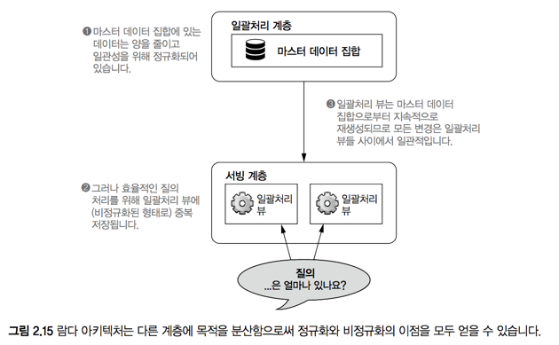

# 2. 빅데이터를 위한 데이터 모델
tags #study #study/big-data

> **학습목표**  
> - 데이터의 속성  
> - 팩트 기반의 데이터 모델  
> - 빅데이터에 팩트 기반 모델 사용시 장점  
> - 그래프 스키마   

#### 마스터 데이터 집합
- 람다 아키텍처에서 **모든 정보의 원천**
* 마스터 데이터 집합이 있는 한, 서빙 & 속도 계층의 데이터가 소실되더라도 복구 가능 
* 누락 / 오염되지 않도록 견고한 설계 & 구축 필요 
* 두 가지 구성요소: **데이터 모델**(이번 장에서 다룰 내용)  & 물리적인 저장 수단 

## 2.1 데이터의 속성 
#### 용어정리
- **정보**: 시스템에 맞게 만들어진 지식의 일반적이 모음
* **데이터**: 다른 어떤 것으로부터 파생되지 않는 정보, 다른 모든것이 파생되는 근본적 이치(공리)로 작용
* **질의**: 데이터에 물어볼 수 있는 질문
* **뷰**: 기반 데이터로부터 파생된 정보, 특정 타입의 질의에 최적화

####  몇 가지 특징
- 정보간 의존성: 각 정보 계층은 전단계로부터 단방향으로 파생(비가역적)
* 누군가 만들어 낸 **정보**는 다른 사람에게 **뷰**가 되고, **데이터**로 작동할 수 있다

### 2.1.1 원시성 
가능한 한 원시적인 데이터 형태를 저장
- 장점: 가공할 수 있는 범위가 넓어진다, 미래에 분석 요건이 새로 생기더라도 과거의 데이터를 분석해 낼 수 있는 여지가 커짐 
* 단점: 저장 공간이 훨씬 더 많이 필요해진다. 

- 비구조화 데이터가 정규화된 데이터보다 더 원시적이다 
- 정보가 많다고 더 원시적인 것은 아니다 

### 2.1.2 불변성
#### immutable data의 두 가지 장점 
- 인적 내결함성 증가
* 단순성 보장

### 2.1.3 영원성
-> 데이터는 영원히 ~진실~ 하다는 뜻 
- 마스터 데이터 집합은 영원히 참인 새 데이터가 추가됨으로 일관되게 사이즈가 증가
* 데이터 삭제는 거의 없으나 특별한 경우: 
	- **가비지 컬렉션**: 보존 가치가 낮은 데이터 단위를 삭제
	- **규제**: 정부 등 상위 기관에 의한 규제

## 2.2 데이터 표현을 위한 팩트 기반 모델 
- 일반적인 데이터 저장 방식인 **관계형 DB**, **XML**(구조화), **Json**(반구조화)의 대안으로 **팩트 기반**(fact-based) 모델 제시 
 
### 2.2.1 팩트의 예와 그 속성 
- 다음 **핵심 속성**들로 인해 *팩트 기반 모델은* 데이터 집합에 대한 단순하고 표현적이 될 수 있다 
	* **원자성**: 유의미한 구조로 더 분할이 어려움, 별개의 팩트 사이에 중복이 없다 
	* **타임스탬프**: 불변성과 영원성을 보장
	* **식별 가능성**: 마스터 데이터 집합의 의미구조 변환 없이 동일한 팩트를 반복 기록 가능 

### 2.2.2 팩트 기반 모델의 장점 
- **과거 특정 시점에 대한 질의 가능**
	* 팩트가 불변성을 가지고 각 팩트는 타임 스탬프를 지니고 있기 때문에 가능 
	* 갱신과 삭제는 최신 타임스탬프가 붙은 팩트의 추가로 이루어진다 
- **인적 내결함성 보장**
	* 잘못된, 오염된 정보: 단순히 해당 내용을 삭제하면 된다 
* **부분 정보의 손쉬운 처리**
	* 레코드별로 팩트를 저장하면 NULL을 남발하지 않고도 부분 정보를 쉽게 처리 가능 
* **데이터 저장소와 질의 처리 계층의 분리**
	* 데이터가 정규화된 형태(serving-layer)와 비정규화된 형태(batch layer) 모두로 존재하여 양쪽의 장점을 취사 선택 가능

#### 람다 아키텍처에서의 정규화 & 비정규화 

- 	마스터 데이터 집합
	- 완전히 정규화되어 구성: 어떤 데이터도 중복되지 않음 
	* 데이터 갱신: 새 팩트를 타임스탬프를 붙여 저장하면 관련된 과거 팩트를 무효화
* 일괄처리 뷰
	* 비정규화된 데이터: 하나의 *마스터 데이터 집합*으로 여러가지 뷰를 생성 가능 
	* *마스터 데이터 집합*에 대한 **함수**다: ~따로 어딘가에 저장하는 데이터가 아님~
	-> 뷰는 갱신할 필요가 없으며, 마스터 데이터와 불일치할 일도 없다

