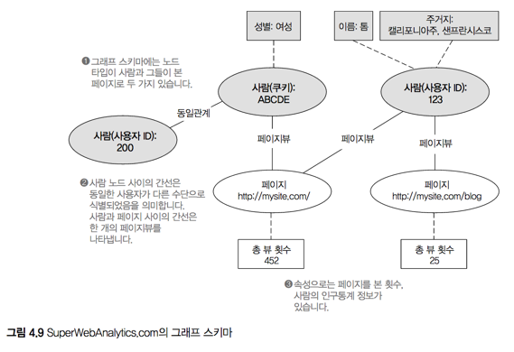

# 4. 일괄처리 계층의 데이터 저장소

> 학습목표
- 마스터 데이터 집합 저장소의 요구사항
- 분산 파일시스템
- 수직 분할로 효율성 개선

## 4.1 마스터 데이터 집합 저장소의 요구사항

- 데이터가 어덯게 쓰여지고 읽혀질지 고려할 것 (변경, 삭제는 고려사항이 아님)
- 꾸준히 증가하는 대량의 데이터 처리 능력이 중요
- 개별 데이터에 대한 무작위 접근보다는 한 번에 많은 데이터를 읽는 능력이 중요

> 데이터는 한 번만 쓰고, 읽기는 큰 단위로 여러 번 수행한다

### 마스터 데이터 집합의 저장소 적합여부 Checklist
#### Write
- [ ] **효율적인 데이터 추가** 가 가능한가?
- [ ] 마스터 데이터 셋은 크기가 방대해 질 수 있는데 저장소가 **확장성** 이 있는가?

#### Read
- [ ] 테라&페타바이트의 마스터 데이터 집합을 확장성 있게 다룰수 있는 **병렬 처리** 를 지원 하는가?

#### Common
- [ ] 저장 비용(압축)과 처리 비용(속도)을 **유연하게 조절 가능** 한가?
- [ ] 마스터 데이터 집합의 기본 전제조건인 **데이터 불변성을 강제** 할 수 있는가?


## 4.2 일괄처리 계층을 위한 저장소 솔루션 선택

### 4.2.1 Key-Value storage
- 여러 장비에 분산되는 거대하고 영속적인 **해시맵**
- 목적의 문제: **값** 은 분명하지만 **키** 는 따로 필요하지 않다 (대량 소비를 전제로 하기에)
- 비용의 문제: 무작위 읽기와 쓰기를 지원하기 위해 여러개의 키-값 쌍을 압축하는 것도 불가능
- 불필요한 자원들의 낭비: 무작위 읽기&쓰기를 가능하게 하는 모든 장치가 불필요(lock, index 등등)

### 4.2.2 Distributed Filesystem
- 여러 모로 Key-Value 저장소보다 마스터 데이터셋의 저장소보다 적합하다
- 일반적으로 단일 장비에만 국한된다는 점이 있지만, **분산 파일시스템** 에서 해당 문제를 극복
- 분산 파일시스템은 내결함성이 보장되지만, 연산이 제한적 (하지만 제한되는 연산은 람다 아키텍처에서 불필요한 기능)

## 4.3 분산 파일시스템의 동작 방식

#### **HDFS** :Hadoop Distributed FileSystem
- 확장성 있는 분산 파일시스템으로 클러스터에 데이터를 어떻게 저장할지 제어
- Namenode와 Datanode로 구성

##### 파일 쓰기
- 파일을 upload하면 해당 파일을 고정된 크기로 분할(64 ~ 256MB)
- 분할된 파일을 임의의 데이터노드로 분산(블록의 위치와 관계를 추적하는 일: Namenode가 담당)
- 또한 분리된 파일들은 복제본을 만들어 원본이 있지 않은 데이터노드에 추가적으로 저장

##### 파일 읽기
- 원하는 파일의 조각들이 어느 Datanode에 있는지 파악하기 위해 Namenode에 정보를 요청
- 개별 노드에 장애가 발생해도 추가 복제본을 가지고 있기에 극단적인 상황 제외하고 내결함성 유지
- Namenode가 맛이 갔다면? SecondaryNamenode라는게 있음

#### 정리
- 파일은 확장성을 위해 여러 장비로 분산 저장되며, 병렬 처리도 가능하게 된다
- 파일 블록은 내결함성을 위해 여러 노드로 복제

## 4.4 분산 파일시스템을 사용하여 마스터 데이터 집합을 저장하기
- 마스터 데이터 집합 전체를 하나의 파일에 적재 불가능: 데이터 집합을 여러 파일로 나누고, 모든 파일을 동일한 폴더에 저장
- 데이터 추가: 새로 생성된 데이터 파일을 마스터 데이터 집합 폴더에 추가

## 4.5 수직 분할 (vertical partitioning)
- 데이터를 분할(partitioning)하여 보관하다가 특정 상황에서 일부 데이터만 접근할 수 있도록 하는 기술: 성능 향상
- ex> 일별 누적 데이터의 경우 하위 폴더를 날짜별로 생성해서 조건(날짜)에 맞추어 데이터 저장

## 4.6 분산 파일시스템의 하위 수준 속성
내결함성을 위해 분산 파일시스템 API를 직접 사용하는건 실행해야 하는 작업에 비해 너무 **저수준 연산** 이다

#### ex> 마스터 데이터 집합인 `/master` 폴더에 `/new-data` 폴더에 있는 데이터를 추가
```
foreach file:"/new-data"
  mv file "/master"
```
##### `mv` 같이 추상화 수준이 낮은 OS 명령으로 복제시 문제점
- `/master`에 중복 파일이 존재하는 경우 실패
- 기존 데이터와 새로 들어온 데이터간 압축 형식이 상이할 경우 문제
- 수직 분할이 된 경우, 데이터를 바로 복제하는 경우 수직분할 구조에 맞추어 데이터를 분산해서 추가해야 함

-> 이런 문제점들을 해결한 라이브러리 등을 적극 활용(5장에서 등장)  


## 4.7 `SuperWebAnalytics.com`의 마스터 데이터 집합을 분산 파일시스템에 저장하기



- 모든 간선과 속성 타입은 각자의 폴더에 저장: 자연스러운 수직 분할


## 4.8 마무리

#### 공부한 것
- 람다 아키텍처의 일괄처리 계층에 데이터를 저장시 수반되는 상위 수준 요구는 매우 단순함
- HDFS가 람다 아키텍처의 마스터 데이터 집합에 매우 적합한 저장소

#### 공부할 것
- 분산 파일시스템을 실제로 사용시 세부 사항을 처리하는 방법
- 파일과 폴더의 하위 수준 속성을 상위 수준 추상화를 통해 다루는 방법
