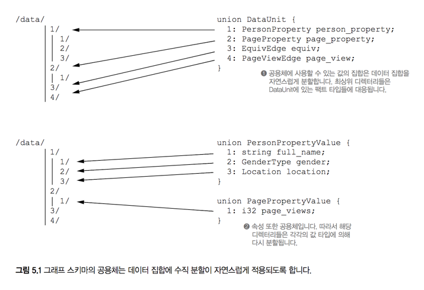
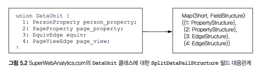

# 5. 일괄처리 계층의 데이터 저장소: 사례

> 학습목표
- 하둡 분산 파일시스템 사용하기
- 데이터 집합 조작을 상위 수준으로 추상화하는 페일

## 5.1 HDFS 사용하기

#### HDFS 간단 복습
- [x] 파일은 블록으로 쪼개져서 클러스터의 여러 노드로 분산
- [x] 블록은 여러 노드로 복제: 내결함성
- [x] 네임노드는 각 파일이 어떤 블록으로 구성되는지와 그 블록이 어느 데이터노드에 저장되는지 추적

### 5.1.1 작은 파일 문제
- 하둡은 데이터가 작은 크기로 여러 파일이 저장된 경우 계산 능력이 하락(10배 까지도...)
- MR작업이 입력 데이터 집합의 각 블록마다 태스크를 하나씩 실행하는데, 작은 파일이 여럿 있으면 그만큼 오버헤드가 발생
- HDFS API를 사용하는 코드를 작성하거나 전용 맵리듀스 작업을 사용해 파일 통합을 해결할 수 있지만 어렵다

### 5.1.2 상위 수준 추상화
**우아한** (원하는 작업을 간결하게 표현 가능한) 솔루션을 찾아봅시다

##### 마스터 데이터 집합 조작시 중요한 두 가지 연산
- [x] 새로운 데이터를 데이터 집합에 추가
- [x] 데이터 집합에 수직 분할을 적용하고 기존 분할이 깨지는 것 방지

##### HDFS의 요구 사항
- [ ] 작은 파일을 큰 파일로 통합할 수 있어야 한다

##### `Pail` 라이브러리
```scala
import java.io.IOException
import backtype.hadoop.pail.Pail

class PailMove {
  def mergeData(masterDir: String, updateDir: String) {
    target: Pail = new Pail(masterDir)    // 1
    source: Pail = new Pail(updateDir)
    target.absorb(source)                 // 2
    target.consolidate                    // 3
  }
}

```
1. `Pail`은 HDFS폴더를 포장한 래퍼
2. 페일 라이브러리를 사용한 추가 작업
3. 페일 내 작은 데이터 파일들을 통합하는 함수

---

- 파일 포맷이 다른 경우 올바른 파일 포맷이 되도록 강제, 수직 분할 방식이 다른 경우 예외 발생
- 파일과 디렉터리같은 하위 수준 컨테이너를 사용하지 않고 데이터를 직접 핸들링

## 5.2 페일을 사용하여 일괄 처리 계층에 데이터를 저장하기
- 페일(`pail`): 데이터 집합에 관한 메타 데이터의 명칭
- 파일과 폴더를 얇게 추상화하여 데이터 추가, 수직분할, 파일 통합등을 쉽고 안전하게 수행

### 5.2.1 기본 연산
#### 새로운 페일에 데이터 저장
```java
public static void simpleIO() throws IOException {
  Pail pail = Pail.create("/tmp/mypail")
  TypeRecordOutputStream os = pail.openWrite();
  os.writeObject(new byte[] {1, 2, 3});
  os.writeObject(new byte[] {1, 2, 3, 4});
  os.writeObject(new byte[] {1, 2, 3, 4, 5});
  os.close();
}
```
- `somename.pailfile`: 페일의 데이터 파일, 원자적으로 생성되며 전역적으로 유일한 이름 사용
- `pail.meta`: 페일에 정의된 데이터의 형식과 저장방법 등을 설명


### 5.2.2 객체 직렬화
##### 간단한 로그인 객체
```java
public class Login {
  public String userName;
  public long loginUnixTime;

  public Login(String _user, long _login) {
    userName = _user;
    loginUnixTime = _login;
  }
}
```

##### 직렬화 코드
```java
public class LoginPailStructure implements PailStructure<Login> {

}
```

##### 위 직렬화 코드를 사용하여 Login을 처리
```java
public static void writeLogins() throws IOException {
  Pail<Login> loginPail = Pail.create("/tmp/logins", new LoginPailStructure());
  TypedRecordOutputStream out = loginPail.openWrite();
  out.writeObject(new Login("alex", 1352679231));
  out.writeObject(new Login("bob", 1352674216));
}

public static void readLogins() throws IOException {
  Pail<Login> loginPail = new Pail<Login>("/tmp/logins");
  for (Login l : loginPail) {
    System.out.println(l.userName + " " + l.loginUnixTime);
  }
}
```
- `Pail.create`를 호출시 위에 정의한 `LoginPailStructure`를 직렬화 방법으로 전달
- 데이터를 읽을때는 따로 Structure가 정의되지 않았는데 meta에 있기 때문인가?
- 데이터가 저장되고 나면 페일 라이브러리의 기본 제공 연산을 사용하여 안전하게 데이터 처리 가능

### 5.2.3 Pail - 일괄처리 계산
- 페일 라이브러리의 연산은 모두 맵리듀스로 구현되어 **확장성이 좋다**
- 추가연산
  - 페일 여러개를 체크해 페일을 함께 추가하는게 유효한지 검증
  - 페일의 포맷 강제
- 통합연산
  - 기본적으로 작은 파일들을 합쳐 가능한 한 128MB에 가까운 크기의 새 파일을 생성

```java
public static void appendData() throws IOException {
  Pail<Login> loginPail = new Pail<Login>("/tmp/logins");
  Pail<Login> updatePail = new Pail<Login>("/tmp/updates");
  loginPail.absorb(updatePail);
  loginPail.consolidate();
}
```

### 5.2.4 Pail - 수직분할
- 페일 라이브러리는 다음 메서드들을 통해 수직 분할을 효율적으로 처리
  - `getTarget`: 레코드가 저장되어야 할 디렉터리 구조를 결정해서 문자열의 목록으로 그 경로를 반환
  - `isValidTarget`: 하나의 디렉터리 경로를 생성하여 그 경로가 수직 분할 방식에 부합하는지 결정

##### `Login`레코드를 위한 수직 분할 로직
```java
public class PartitionedLoginPailStructure extends LoginPailStructure {
  SimpleDateFormat formatter = new SimpleDateFormat("yyyy-MM-dd");

  public List<String> getTarget(Login object) {
    ArrayList<String> directoryPath = new ArrayList<String>();
    Date date = new Date(object.loginUnixTime * 1000L);
    directoryPath.add(formatter.format(date));
    return directoryPath;
  }

  public boolean isValidTarget(String... strings) {
    if (strings.length < 1) return false;
    try {
      return (formatter.parse(strings[0]) != null);
    } catch (ParseException e) {
      return false;
    }
  }
}
```

##### `PartitionedLoginPailStructure`를 사용하여 로그인 객체 파티션에 맞게 기록
```java
public static void partitionData() throws IOException {
  Pail<Login> pail = Pail.create(
    "/tmp/partitioned_logins",
    new PartitionedLoginPailStructure()
  );
  TypedRecordOutputStream os = pail.openWrite();
  os.writeObject(new Login("chris", 1352702020));
  os.writeObject(new Login("david", 1352788472));
  os.close();
}
```

### 5.2.5 파일 포맷과 압축
- 페일 라이브러리에서 파일을 저장하는 방법은 파일 포맷을 지정해서 제어 가능 (기본 포맷: 하둡 `sequenceFile`)
- 어떤 포맷을 선택하느냐에 따라 저장 공간과 레코드를 읽는 성능 사이의 성능 조절

##### `gzip`블록 압축이 적용된 `sequenceFile`포맷이 적용된 페일 생성
```java
public static void createCompressedPail() throws IOException {
  Map<String, Object> options = new HashMap<String, Object>();
  options.put(sequenceFileFormat.CODEC_ARG, sequenceFileFormat.CODEC_ARG_GZIP);
  options.put(sequenceFileFormat.TYPE_ARG, sequenceFileFormat.TYPE_ARG_BLOCK);
  LoginPailStructure struct = new LoginPailStructure();
  Pail compressed = Pail.create("/tmp/compressed", new PailSpec("sequenceFile", option, struct));
}
```
- 압축된 형태기 때문에 저장공간은 적게 잡아먹으나, 읽고 쓸 때 CPU 비용이 높다

### 5.2.6 페일 라이브러리를 사용하는 이점


## 5.3 `SuperWebAnalytics.com`의 마스터 데이터 집합 저장

[schema.thrift](../../models/schema.thrift)
```thrift
struct Data {
  1: required Pedigree pedigree;
  2: required DataUnit dataunit;
}

union DataUnit {
  1: PersonProperty person_property;
  2: PageProperty page_property;
  3: EquivEdge equiv;
  4: PageViewEdge page_view;
}

union PersonPropertyValue {
  1: string full_name;
  2: GenderType gender;
  3: Location location;
}
```
##### 위 스키마를 수직분할이 적용된 폴더에 대응 모델


##### `Data`객체를 저장할 구조화된 페일을 정의하고 수직 분할 방식을 적용하는 로직
1. Thrift 객체를 저장할 추상 페일 구조체 생성
2. `Data`객체를 저장하는 데 사용할 페일 구조체를 1의 추상 클래스에서 상속
3. 필요한 수직 분할방식을 구현하는 서브클래스 정의

### 5.3.1 스리프트 객체를 위한 구조화된 페일
##### 스리프트 유틸리티를 사용하여 데이터를 직렬화하고 역직렬화하는 코드
```java
public abstract class ThriftPailStructure<T extends Comparable> implements PailStructure<T> {
  private transient TSerializer ser;
  private transient TDeserializer des;

  private TSerializer getSerializer() {
    if (ser == null) ser = new TSerializer();
    return ser;
  }

  private TDeserializer getDeserializer() {
    if (des == null) des = new TDeserializer();
    return des;
  }

  public byte[] serialize(T obj) {
    try {
      return getSerializer().serialize((TBase)obj);
    } catch (TException e) {
      throw new RuntimeException(e);
    }
  }

  public T deserialize(byte[] record) {
    T ret = createThriftObject();
    try {
      getDeserializer().deserialize((TBase)ret, record);
    } catch (TException e) {
      throw new RuntimeException(e);
    }
    return ret;
  }

  protected abstract T createThriftObject();
}
```

### 5.3.2 `SuperWebAnalytics.com`을 위한 기본 페일
##### `Data` 객체를 저장할 기본 클래스를 `ThriftPailSturcture`의 구체 서브클래스로 정의
```java
public class DataPailStructure extends ThriftPailStructure<Data> {
  public Class getType() {
    return Data.class;
  }

  protected Data createThriftObject() {
    return new Data();
  }

  public List<String> getTarget(Data object) {
    return Collections.EMPTY_LIST;
  }

  public boolean isValidTarget(String... dirs) {
    return true;
  }
}
```

### 5.3.3 데이터 집합을 수직 분할하기 위한 페일
- 그래프 스키마를 위한 수직 분할 전략을 구현

#### `SplitDataPailSturcture`는
- `DataUnit`클래스를 스리프트 ID와 해당 타입을 처리하는 클래스 사이의 대응 관계 생성


```java
public class SplictDataPailStructure extends DataPailStructure {
  public static HashMap<Short, FieldStructure> validFieldMap = new HashMap<Short, FiledStructure>();

  static {
    for (DataUnit._Fields k: DataUnit.metaDataMap.keySet()) {
      FieldValueMetaData md = DataUnit.metaDataMap.get(k).valueMetaData;
      FieldStructure fieldStructure;
      if (md instanceOf structMetaData
        && ((structMetaData) md).structClass.getName().endsWith("property")) {
          fieldStruct = new PropertyStructure(((StructMetaData) md).structClass);
        } else {
          fieldStruct = new EdgeStructure();
        }
        validFieldMap.put(k.getThriftFieldId(), FiledStruct);
    }
  }
  // ...
}
```

#### `FieldStructure` 인터페이스
- `PropertyStructure`, `EdgeStructure`에서 공유됨
```java
protected static interface FiledStructure {
  public boolean isValidTarget(String[] dirs);
  public void fillTarget(List<String> ret, Object val);
}
```

#### 위 인터페이스에서 수직분할 구현
```java
public List<String> getTarget(Data object) {
  List<String> ret = new ArrayList<String>();
  DataUnit du = object.get_dataunit();
  short id = du.getSetField().getThriftFieldId();
  ret.add("" + id);
  validFieldMap.get(id).fillTarget(ret, du.getFieldValue());
  return ret;
}

public boolean isValidTarget(String[] dirs) {
  if(dirs.length == 0) return false;
  try {
    short id = Short.parseShort(dirs[0]);
    FieldStructure s = validFieldMap.get(id);
    if (s == null) {
      return false;
    } else {
      return s.isValidTarget(dirs);
    }
  } catch (NumberFormatException e) {
    return false;
  }
}
```  

- `SplitDataPailSturcture`는 수직 분할의 최상위 디렉터리를 책임
- `FiledStructure`가 하위 디렉터리 책임 -> `EdgeStructure`, `PropertyStructure` 구현

#### `EdgeStructure`
- 간선, 구조체이기 때문에 더 이상 분할 불가능 (속성의 경우 공용체)

```java
protected static class EdgeStructure implements FieldStructure {
  public boolean isValidTarget(String[] dirs) { return true; }
  public void fillTarget(List<String> ret, Object val) { ... }
}
```

#### `PropertyStructure`
- 속성, 공용체
- 비슷하게 주어진 속성 클래스를 조사하여 유효한 스리프트 필드 ID 집합을 생성 & 사용

```java
protected static class PropertyStructure implements FieldStructure {
  private TFieldEnum ValueId;
  private HashSet<Short> validIds;

  public PropertyStructure(Class prop) {
    try {
      Map<TFieldIdEnum, FieldMetadata> propMeta = getMetadataMap(prop);
      Class valClass = Class.forName(prop.getName() + "Value");
      valueId = getIdForClass(propMeta, valClass);

      validIds = new HashSet<Short>();
      Map<TFieldIdEnum, FieldMetadata> valMeta = getMetadataMap(valClass);
      for (TFieldIdEnum valId: valMeta.keySet()) {
        validIds.add(valid.getThriftFieldId());
      }
    } catch (Exception e) {
      throw new RuntimeException(e);
    }
  }

  public boolean isValidTarget(String[] dirs) {
    if (dirs.length < 2) return false;
    try {
      short s = Short.parseShort(dirs[1]);
      return validIds.contains(s);
    } catch (NumberFormatException e) {
      return false;
    }
  }

  public void fillTarget(List<String> ret, Object val) {
    ret.add("" + ((TUnion) ((TBase)val)
      .getFieldValue(valueId))
      .getSetField()
      .getThriftFieldId());
  }
}

private static Map<TFieldIdEnum, FieldMetadata> getMetadataMap(Class c) {
  try {
    Object o = c.newInstance();
    return (Map) c.getField("metaDataMap").get(o);
  } catch (Exception e) {
    throw new RuntimeException(e);
  }
}

private static TFieldIdEnum getIdForClass (Map<TFieldIdEnum, FieldMetadata> meta, Class toFind) {
  for (TFieldIdEnum k: meta.keySet()) {
    FieldValueMetaData md = meta.get(k).valueMetaData;
    if (md instanceof StructMetaData) {
      if (toFind.equals(((StructMetaData) md).structClass)) {
        return k;
      }
    }
  }

  throw new RuntimeException("Could not find" + toFind.toString() + " in " + meta.toString());
}
```

## 5.4 요약
#### 배운 것
- HDFS에 데이터를 쌓기 위하여 수직 분할작업을 거치고 작은 파일을 통합하는 등의 과정은 성가시다
- 이를 도와주는 **Pail** Library
- 추상화를 통해 간결한 코드 작성으로 위의 성가신 작업들을 신경쓰지 않아도 쉽게 처리(로직에 집중)

#### 배울 것
- 레코드 저장소를 사용하여 일괄처리 뷰를 계산하는 방법
