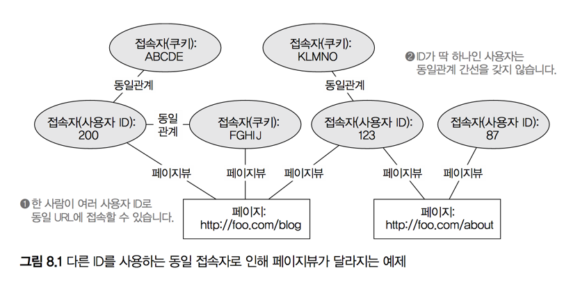
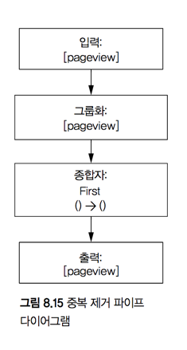

# 8. 일괄처리 계층 예제: 아키텍처와 알고리즘
> 학습목표
- 일괄처리리 계층의 실제 구축
- 사전계산의 실례
- 반복 그래프 알고리즘
- 효율적인 집합 내 원소 수 계산을 위한 하이퍼로그로그

### 일괄처리 계층의 역할
- 데이터의 스키마 서식화
- 마스터 데이터 집합을 저장
- 복잡도를 최소화하며 계산을 실행

## 8.1 `SuperWebAnalytics.com` 일괄처리 계층의 설계

### 8.1.1 지원 질의
- [] **시간대별 페이지뷰**
- [] **시간대별 순방문자**
- [] **이탈률 분석**

- '대상자'의 모델링에 따라 질의의 복잡도가 증가
  - ID 혹은 쿠키로 동일 사용자를 구분하는데, 쿠키는 여러모로 변경될 가능성이 높다
  - 따라서 스키마에서 두 개의 다른 사용자 표현이 실제로 같은 사람일 경우를 위해 **동일관계** 간선 정의
  - **순 방문자** 계산을 위해 다른 식별자(ID, 쿠키, 혹은 변경된 쿠키)를 사용하는 동일한 사용자의 페이지뷰 파악 필요




### 8.1.2 일괄처리 뷰
핵심: **사전계산 뷰**를 위한 데이터 양과 질의 수행 시점에 **즉시 계산에 필요한** 데이터 양의 균형 유지

#### 시간대별 페이지뷰
##### 문제점
- 최소 한 시간단위 시간대 계산: 연간 3천 8백만개 시간 단위 계산 값 필요
- 시간대별 값을 미리 계산: 1년 단위 데이터 추출 시, 최대 8,760일치 데이터를 추출해야 하는데 HDFS의 디스크 읽기작업 증가

##### 해결책
- 월, 주, 일 단위를 모두 사전 계산하여 저장: 필요한 단위만 일별 데이터를 불러오고 나머지는 기간에 따라 필요한 구간의 데이터 읽기

#### 시간대별 순방문자
##### 문제점
- 순방문자는 단순 방문자수의 합계가 아님: Grouping 필요
- 임의 시간 범위에 대한 정확한 순방문자는 **즉시계산** 으로 계산

##### 해결책
- 정확도를 조금 희생한 근사 알고리즘 사용: *하이퍼로그로그(HyperLogLog)*
- 인터페이스
```java
interface HyperLogLog {
  long size();
  void add(Object o);
  HyperLogLog merge(HyperLogLog... otherSets);
}
```
  - `HyperLogLog` 객체: 원소의 집합
  - `add`: 새로운 원소를 집합에 추가
  - `merge`: 다른 집합과 병합
- 이후 집계는 시간대별 페이지뷰와 비슷하게 진행(일, 주, 월 단위 사전계산)

#### 이탈률 분석
- 도메인별로 이탈된 방문 수와 총 방문 수를 구하여 비율 계산
- 방문의 정의: 두 페이지뷰를 비교하여 같은 사용자가 같은 도메인에서 왔고, 시차가 30분 이내인 경우 동일한 방문으로 간주
- 이탈의 정의: 한 방문에 페이지뷰가 유일한 경우 이탈로 간주


## 8.2 전체 작업흐름
1. 마지막 배치작업 이후 새로 유입된 데이터 마스터 데이터 집합에 추가
2. 정규화
  - URL 표준화
  - 동일인이 다른 식별자로 접근한 경우 (ID, 쿠키 등)
3. 중복된 페이지뷰 이벤트 제거
4. 위에 정제된 정보를 기반으로 **일괄처리 뷰 생성**

- 위 작업흐름은 순수한 **재계산** 작업흐름
  - 일괄처리 뷰의 다양한 증분 처리 방법이 있으나, 뷰의 내용이 오염될 경우등의 재계산 필요성 등으로 인해 정의해 둘 필요 있음


## 8.3 새 데이터 채워넣기
- 단순히 새 데이터 유입시마다 마스터 데이터 집합에 추가?
  - 문제점: 마스터 데이터 집합에 대해 여러 일괄처리 뷰 계산시 중간에 데이터 추가로 인한 마스터 데이터 집합의 변경 가능성
  - 해결책: 새 데이터는 `new-data/`등의 폴더에 저장후 일괄처리 프로세스의 첫 단계에 `new-data/`의 데이터를 `mv`


## 8.4 URL 정규화
- 정규화 로직은 한 함수 내에서 필요한 기능이 다 갖춰진 형태
- 모든 URL에 대해 독립적으로 동작해야 함


## 8.5 사용자 식별자 정규화
- 완전 분산 반복 그래프 알고리즘 필요


## 8.6 페이지뷰의 중복 제거



## 8.7 일괄처리 뷰 계산
- 이 장에서는 색인되지 않은 레코드 생성 까지만...

### 8.7.1 시간대별 페이지뷰
1. 시각단위 페이지뷰 산출: 데이터 압축 효과     
    - 입력: `[userid, url, timestamp]`
    - 함수: `ToHourBucket(timestamp) -> (bucket)`
    - 그룹화: `[url, bucket]`
    - 종합자: `Count() -> (num-pageviews)`
    - 출력: `[url, bucket, num-pageviews]`

2. 시간대별 페이지뷰 계산을 모든 시간 단위로 수행
    - 입력: `[url, hour-bucket, hour-pageviews]`
    - 함수: `EmitGranularities(hour-bucket) -> (granularity, bucket)`
    - 그룹화: `[url, granularity, bucket]`
    - 종합자: `Sum(hour-pageviews) -> (bucket-pageviews)`
    - 출력: `[url, granularity, bucket, bucket-pageviews]`

```
function emitGranularities(hourBucket) {
  dayBucket = hourBucket / 24;
  weekBucket = dayBucket / 7;
  monthBucket = dayBucket / 28;

  emit("h", hourBucket);
  emit("d", dayBucket);
  emit("w", weekBucket);
  emit("m", monthBucket);
}
```

### 8.7.2 시간대별 순방문자
- 모든 URL에 대해 모든 시간 단위로 추적 계산한 하이퍼로그로그 집합으로 구성
  - 입력: `[url, timestamp, userid]`
  - 함수: `ToHourBucket(timestamp) -> (hour-bucket)`
  - 그룹화: `[url, bucket]`
  - **종합자: `ConstructHyperLogLog(userid) -> hll`**
  - 함수: `EmitGranularities(hour-bucket) -> (granularity, bucket)`
  - 그룹화: `[url, granularity, bucket]`
  - **종합자: `MergeHyperLogLog(hll) -> (bucket-hll)`**
  - 출력: `[url, granularity, bucket, bucket-hll]`


### 8.7.3 이탈률 분석
- 특정 도메인에 대해 특정인이 남긴 페이지뷰를 시간순으로 정렬해서 조사
- 연속적인 PV간 시간차를 사용해서 동일 방문인지 판단 후 방문 PV가 하나밖에 없으면 이탈로 간주
  - 입력: `[url, timestamp, userid]`
  - 함수: `ExtractDomain(url) -> (domain)`
  - 그룹화: `[domain, userid]`
  - **종합자: `AnalyzeVisits(timestamp) -> (num-visits, num-bounces)`**
  - 그룹화: `[domain]`
  - 종합자: `Sum(num-visits) -> (total-visits)`
  - 종합자: `Sum(num-bounces) -> (total-bounces)`
  - 출력: `[domain, total-visits, total-bounces]`


## 8.8 요약
#### 배운 것
- 일괄처리 계층의 단순함
  - 중분 계산이 아닌 모든 데이터에 대해 계산 함수를 실행하여 복잡한 로직도 단순화 가능
- 일괄처리 계산의 유연함
  - 작업 흐름 단계마다 모든 데이터 대상으로 자유롭게 임의의 함수 실행가능: 일괄처리 계층을 확장하여 새로운 뷰를 계산 용이

#### 배울 것
- 복잡성을 증대시키지 않는 증분화(18장)
- `SuperWebAnalytics.com`에서의 실제 적용
